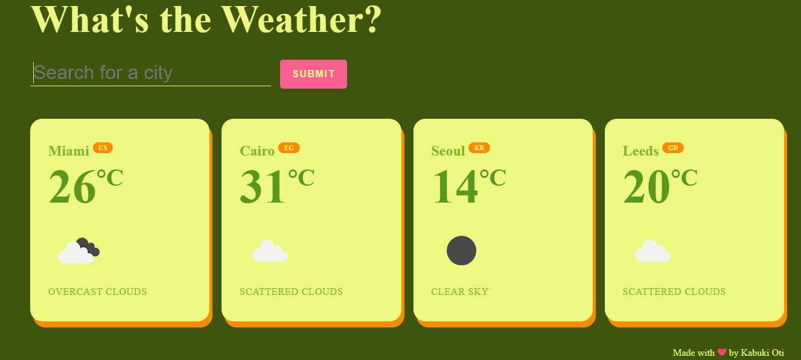

# Weather App

A weather app that allows users to search for weather information by city name and view the current weather conditions.



## Table of Contents

- [Introduction](#introduction)
- [Features](#features)
- [Technologies](#technologies)
- [Installation](#installation)
- [Usage](#usage)

## Introduction

This is a weather app that enables users to search for weather information for a specific city. It utilises the OpenWeatherMap API to fetch weather data and displays it in an organised and user-friendly manner.

## Features

- **City Weather Data**: Users can search for a city by name and retrieve current weather data, including temperature, weather description, and an icon representing the weather conditions.

- **Error Handling**: The app provides error handling, displaying a message when a city is not found or when there is an issue with the API request.

- **Responsive Design**: The app is designed to be responsive and adapts to different screen sizes, making it accessible on various devices.

## Technologies

- HTML
- CSS
- JavaScript (ES6+)
- OpenWeatherMap API

## Installation

1.  Clone the repository to your local machine:

    ```
    git clone https://github.com/yourusername/weather-app.git
    ```

2.  Open the project folder in your code editor.

3.  Obtain an API key from [OpenWeatherMap](https://openweathermap.org/) by signing up for a free account.

4.  Create a `config.js` file in the project directory and add your API key:

    ```javascript
    // config.js
    export const apiKey = "YOUR_API_KEY";
    ```

    or

    Replace

    ```javascript
    //index.js
    import { apiKey } from "./config.js
    ```

    with

    ```javascript
    //index.js
    const apiKey = "YOUR API KEY"
    ```

5.  Open the `index.html` file in your web browser or deploy it to a web server.

## Usage

1. Search by entering a city name (e.g breda) or comma-separated city name along with the country code (e.g breda,nl)

2. Click the "SUBMIT" button or press Enter.

3. The app will display the current weather information for the entered city, including the city name, temperature, weather description, and an icon representing the weather conditions.

4. If the city is not found or there is an issue with the API request, an error message will be displayed.

5. You can search for multiple cities, and their weather information will be added to the list in the "ajax-section."

---

Enjoy checking the weather!
